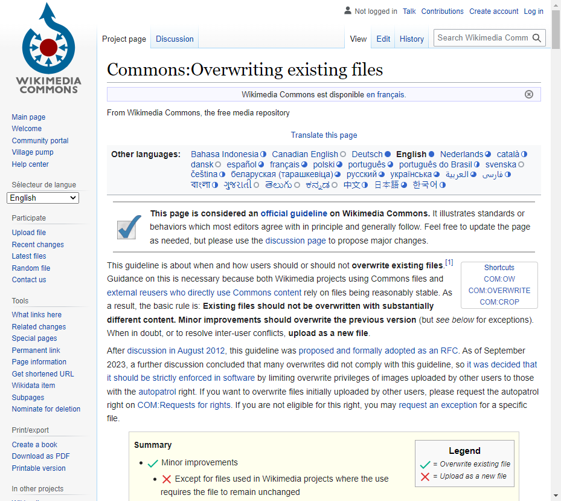

# Random Wikipedia walker

Yoann DEWILDE\
Enora DANILO\
M2 ILa - Groupe 1

Using Selenium, create a small program that, starting from the main page https://www.wikipedia.org/, walks trough a sequence of random links and takes a snapshot of the last page.
The process is as follows:

 1. Navigate to the main page https://www.wikipedia.org/
 2. Select a random link in the page
 3. Navigate to the link
 4. Repeat steps 2 to 3 until you have visited 10 different pages
 5. Take a snapshot of the current page and save it

Include the code of the walker and the snapshot in this document.

## Answer

Code également disponible [ici](../code/exo-1-wikipedia/src/main/java/fr/istic/ydewilde/App.java).

```java
public class App {
    private static String SCREENSHOT_PATH = "./exo1_wikipedia_screenshot.png";

    public static void main(String[] args) throws IOException {
        WebDriver driver = new ChromeDriver();
        String currentUrl = "https://www.wikipedia.org/";
        driver.get(currentUrl);
        System.out.println(driver.getTitle());

        for (int i = 0; i < 10; i++) {
            driver.manage().timeouts().implicitlyWait(Duration.ofMillis(500));

            System.out.println("======= " + (i + 1) + " ==========");
            List<WebElement> links = driver.findElements(By.xpath("//a"));
            for (WebElement l : links) {
                System.out.println("Possible link\t" + l.getAttribute("href"));
            }
            WebElement nextLink = links.get((int) Math.floor(Math.random() * links.size()));
            currentUrl = nextLink.getAttribute("href");
            System.out.println("\n\n");
            // System.out.println(currentUrl + "\n" + nextLink.getAttribute("href"));
            System.out.println("Next link: " + currentUrl);
            driver.get(currentUrl);
        }

        System.out.println("===================\nLast page: " + currentUrl);

        byte[] screenshot = ((TakesScreenshot) driver).getScreenshotAs(OutputType.BYTES);
        Files.write(Paths.get(SCREENSHOT_PATH), screenshot);

        driver.quit();

        System.exit(0);
    }
}
```

